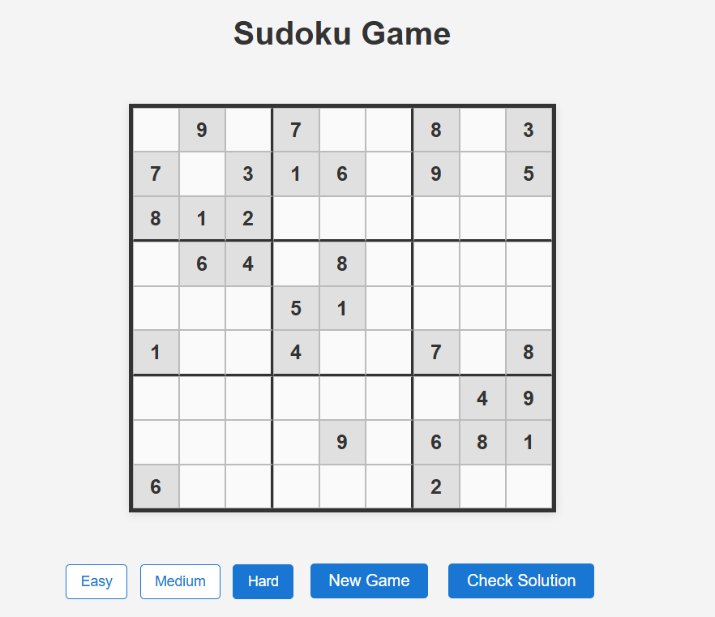
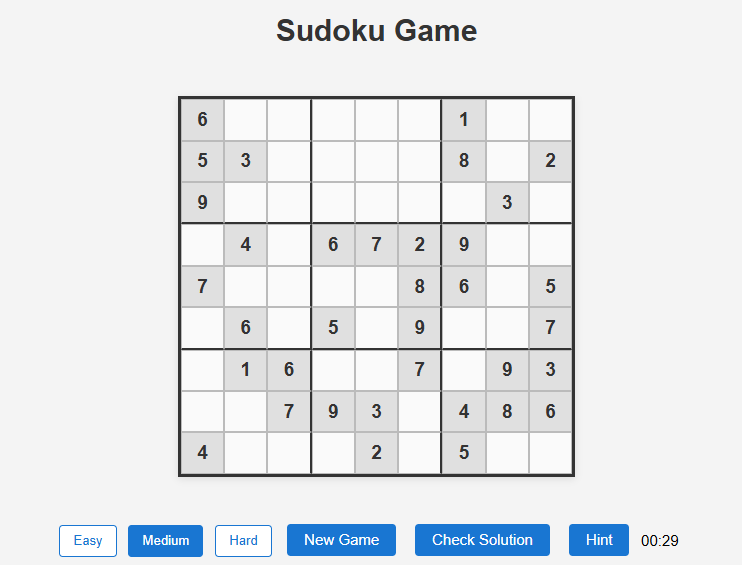
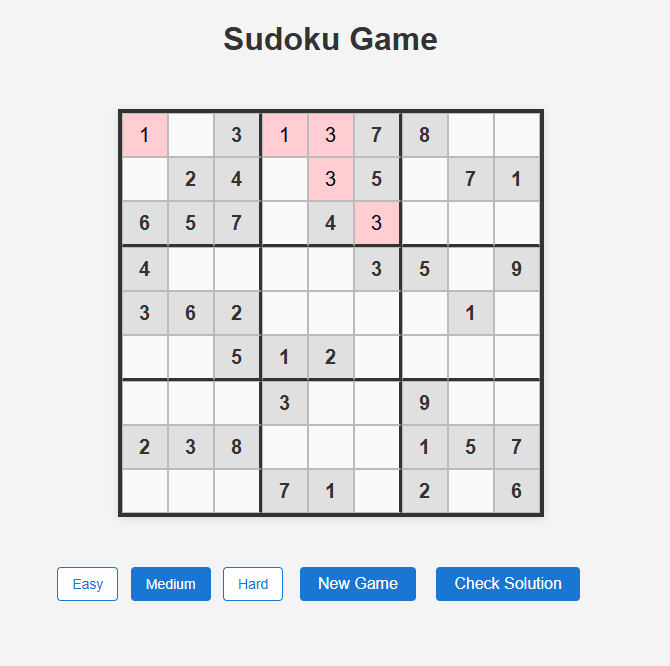
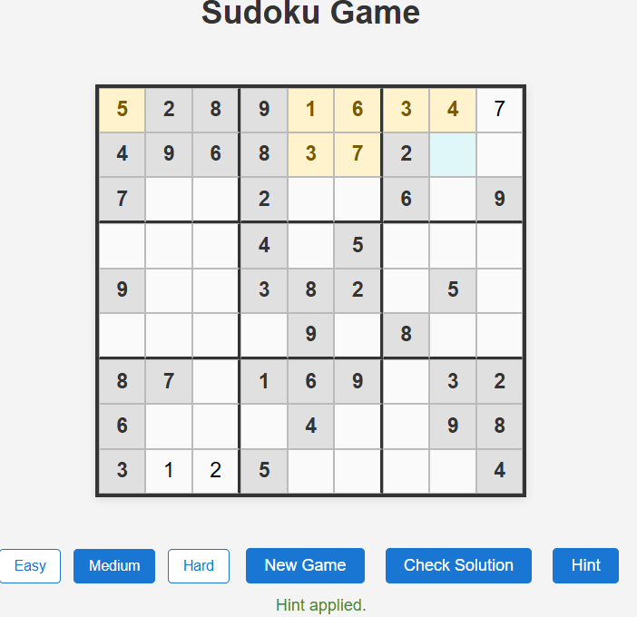
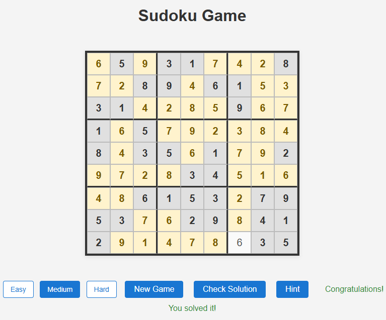
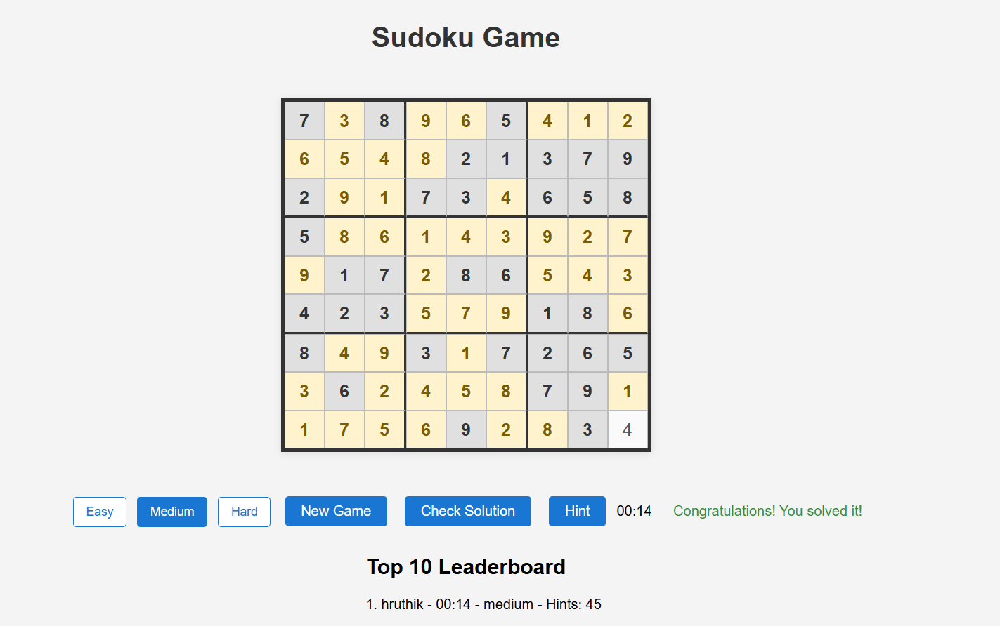
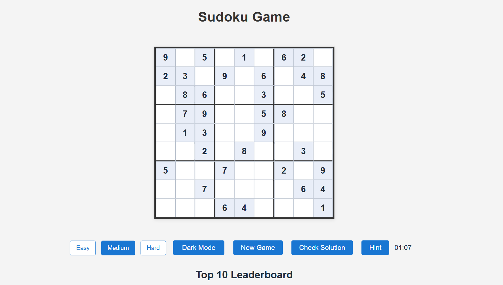
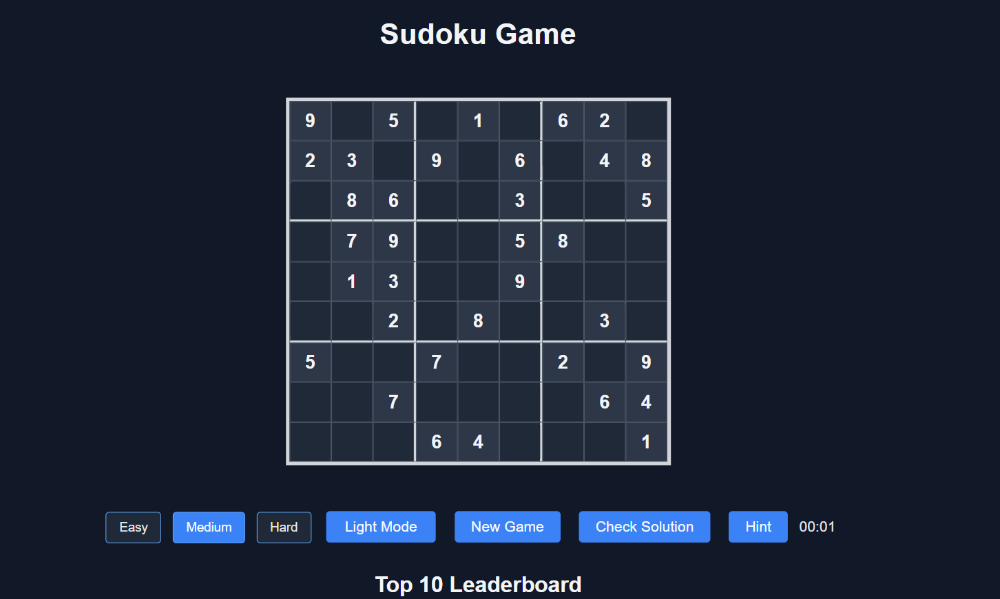
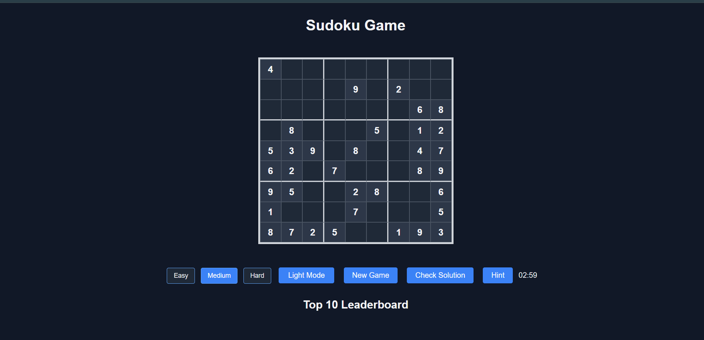

# Flask Sudoku Game

A browser-based Sudoku game built with Python and Flask. The application generates valid Sudoku puzzles, supports multiple difficulty levels, validates user input, tracks game time, and stores the Top 10 leaderboard in the browser using local storage.

## Project Purpose

This project is a small web application for playing Sudoku in the browser. It demonstrates a Flask backend, JavaScript-driven client interactions, and a lightweight game loop that includes puzzle generation, validation, hints, timer tracking, and score persistence.

The app is designed to be easy to run locally and to keep the active game state in memory while using browser-local storage for the leaderboard and theme preference. It does not use a database.

## Features Implemented

The current implementation includes the following features:

- Unique-solution puzzle generation using a Sudoku solver and uniqueness validation
- Easy, Medium, and Hard difficulty levels
- Locked prefilled cells
- Immediate visual feedback for invalid moves
- Check Solution functionality that identifies incorrect cells
- Hint functionality that fills one correct empty cell
- Timer for each game
- Completion detection and success message
- Top 10 leaderboard
- Player name entry on completion
- Browser localStorage persistence for leaderboard data
- Light mode and dark mode support
- Responsive desktop and mobile layout
- Alternating visual styling for the nine 3x3 Sudoku regions

## Project Structure

```text
github-copilot-python/
├── LICENSE.txt
├── README.md
├── CODEOWNERS
├── starter/
│   ├── app.py
│   ├── requirements.txt
│   ├── sudoku_logic.py
│   ├── Screenshots/
│   │   ├── alternating_3x3_grid.png
│   │   ├── dark_mode_dark_theme.png
│   │   ├── dark_mode_light_theme.png
│   │   ├── difficulty_levels.png
│   │   ├── hint_feature.png
│   │   ├── puzzle_completed.png
│   │   ├── realtime_validation.png
│   │   ├── responsive_desktop_view.png
│   │   ├── responsive_mobile_view.png
│   │   ├── timer_running.png
│   │   ├── top10_leaderboard.png
│   │   └── copilot_*.png
│   ├── static/
│   │   ├── main.js
│   │   └── styles.css
│   ├── templates/
│   │   └── index.html
│   └── tests/
│       └── test_app.py
└── .github/
    └── copilot-instructions.md
```

Key files:

- starter/app.py: Flask routes and current game state
- starter/sudoku_logic.py: Sudoku generation, validation, and solution logic
- starter/templates/index.html: game layout and controls
- starter/static/main.js: browser-side logic for gameplay, timer, hint, leaderboard, and theme
- starter/static/styles.css: Sudoku board styling, dark mode, responsive layout, and region colors
- starter/tests/test_app.py: pytest coverage for the Flask app and game behavior

## Technologies Used

- Python
- Flask
- HTML
- CSS
- JavaScript
- pytest
- Browser localStorage for persistent client-side state

## Installation and Setup

Navigate to the cloned repository, then change into the starter directory and create a virtual environment:

### Windows

```bash
cd path/to/cloned/repository
cd starter
python -m venv .venv
.venv\Scripts\activate
```

### macOS / Linux

```bash
cd path/to/cloned/repository
cd starter
python -m venv .venv
source .venv/bin/activate
```

Install the project dependencies:

```bash
pip install -r requirements.txt
```

## Running the Application

From the starter directory:

```bash
cd starter
python app.py
```

Then open the app in a browser:

```text
http://127.0.0.1:5000
```

## Running the Tests

From the starter directory:

```bash
cd starter
python -m pytest -q
```

## GitHub Copilot Usage

GitHub Copilot was used throughout the project as a development aid for:

- analyzing the legacy codebase and identifying refactoring opportunities
- planning small, targeted changes for the Flask app and UI
- implementing and refining features such as puzzle generation, difficulty handling, hints, timing, and leaderboard support
- reviewing generated code and adjusting it to match the project requirements
- testing and validating the application behavior with pytest

The repository includes screenshots in starter/Screenshots that capture parts of this workflow and the resulting application behavior.

## Screenshots and Evidence

The project includes a set of screenshot artifacts in starter/Screenshots that demonstrate the implemented user experience and supporting workflow. A representative subset is shown below:



















Additional Copilot workflow evidence is also available in starter/Screenshots, including images showing the analysis, iteration, and testing process.

## Important Implementation Notes

- Leaderboard entries are stored locally in the browser using localStorage and are not saved to a database.
- Theme preference is also stored locally in the browser using localStorage.
- The Flask app keeps the active puzzle state in memory for the current game session.
- The application does not use a database or server-side persistence for scores.
- The project is a lightweight single-page web app built around Flask routes and browser-side JavaScript interactions.

## Summary

This project delivers a functional Flask Sudoku web application with a generated puzzle, difficulty settings, invalid-move feedback, hints, a timer, completion detection, and a local Top 10 leaderboard. It is structured as a simple Flask app with separate logic, templates, static assets, and tests, and it provides a clear path for local setup and verification.
